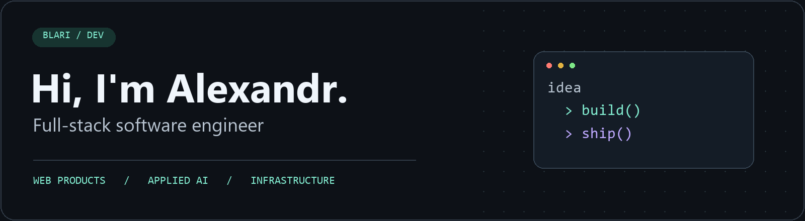

  

  <a href="https://www.linkedin.com/in/blari/">LinkedIn</a> &nbsp; / &nbsp;
  <a href="mailto:blarior@gmail.com">Email</a> &nbsp; / &nbsp;
  <a href="https://github.com/blari?tab=repositories">Repositories</a>

## Hey, I'm Alexandr 👋

I'm a **full-stack software engineer based in Minsk, Belarus**, with **6+ years of experience** building web applications for products and clients.

I work across **React, Next.js, Node.js and Ruby on Rails**, taking features from requirements and architecture through deployment and maintenance. My AI work includes code generation, RAG, semantic search, and tools that agents can use through MCP.

Previously a JavaScript and computer science teacher. I still enjoy explaining tricky things, sharing what I learn, and meeting people who like building useful software.

## My toolkit

  

| Area | Technologies & focus |
| :--- | :--- |
| Frontend | React, Next.js, TypeScript, Tailwind CSS; also Angular and Vue |
| Backend | Node.js, Express, Fastify, NestJS, Ruby on Rails, REST, WebSockets |
| Applied AI | LLM APIs, RAG, semantic search, MCP, structured outputs |
| Data & delivery | PostgreSQL, Redis, ChromaDB, Docker, CI/CD, self-hosted infrastructure |

---

**Have something interesting to build or talk about?** [Say hello →](mailto:blarior@gmail.com)
